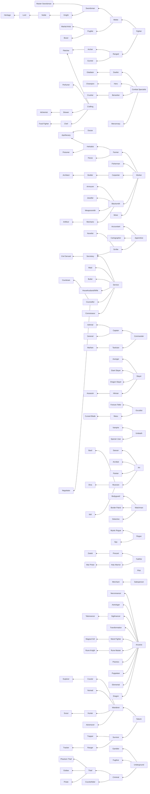

CLASSES
 

```mermaid
graph RL 
Fighter --> Melee --> Swordsman 
Swordsman ---> MS(Master Swordsman) 
Fighter --> Ranged --> Archer --> Fletcher 
Swordsman --> Knight 
Knight --> Noble --> Lord --> Heritage 
Melee --> Pugilist --> MA(Martial Artist) 
Pugilist --> Boxer 
Ranged --> Gunner 
CoS(Combat Specialist) --> Duelist --> Gladiator 
CoS(Combat Specialist) --> Hero --> Champion 
CoS(Combat Specialist) --> Berserker --> Crusher 
CoS(Combat Specialist) --> Mercernary 
Crafting --> Fletcher 
Crafting --> Perfumer 
Crafting --> Brewer --> Alchemist 
Crafting --> Chef --> FF(Food Fighter) 
Doctor --> Apothecary 
Worker --> Farmer 
Farmer --> Herbalist 
Farmer --> Florist 
Herbalist --> Apothecary 
Herbalist --> Poisoner 
Worker --> Fisherman 
Carpenter --> Builder 
Worker --> Carpenter 
Builder --> Architect
Worker --> Blacksmith 
Blacksmith --> Armourer 
Blacksmith --> Jeweller 
Blacksmith --> Weaponsmith 
Blacksmith --> Mechanic --> Artificer 
Worker --> Miner 
Apprentice --> Accountant 
Apprentice --> Cartographer 
Apprentice --> Scribe --> Novelist 
Scribe --> Secretary 
Secretary --> CS(Civil Servant) 
Service --> Secretary 
Service --> Maid 
Service --> Butler 
Service --> Househusband/Wife 
Service --> Counsellor 
Counsellor --> Courtesan 
Counsellor --> Negotiator 
Service --> Connoisseur 
Commander --> Captain --> Admiral
Captain --> General 
Commander --> Tactician --> Warfare 
Slayer --> Avenger 
Slayer --> GS(Giant Slayer) 
Slayer --> DS(Dragon Slayer)
Slayer --> Hitman --> Assassin 
Occultist --> FT(Fortune Teller) 
Occultist --> Maou --> CB(Cursed Blade) 
Undeath --> Vampire 
Undeath --> SU(Specter User) 
Art --> Dancer 
Art --> Acrobat 
Art --> Painter 
Art --> Musician 
Musician --> Bard 
Musician --> Diva 
Musician --> Idol 
Watchman --> Bodyguard 
Watchman --> BP(Border Patrol) 
Watchman --> Detective 
Rogue --> MR(Mystic Rogue) 
Rogue --> Spy 
Faithful --> Precant --> Zealot 
Faithful --> HW(Holy Warrior) --> WP(War Priest) 
Pilot 
Salesperson --> Merchant 
Arcanist --> Necromancer 
Arcanist --> Astrologer 
Arcanist --> Sigilmancer --> Talismancer 
Arcanist --> Transformation 
Arcanist --> WF(Wand Fighter) --> MG(Magical Girl) 
Arcanist --> RM(Rune Master) --> RK(Rune Knight) 
Arcanist --> Psionics
Arcanist --> Puppeteer 
Arcanist --> Elemental 
Arcanist--> Dragon 
Nature --> Wanderer --> Courier --> Explorer 
Wanderer --> Nomad 
Wanderer --> Hunter --> Scout 
Nature --> Survivor --> Trapper 
Survivor --> Ranger --> Tracker 
Wanderer --> Adventurer 
Underground --> Gambler 
Underground --> Fugitive 
Underground --> Criminal --> Thief 
Criminal --> Counterfeiter 
Thief --> PH(Phantom Thief) 
Thief --> Outlaw 
Thief --> Pirate
```
